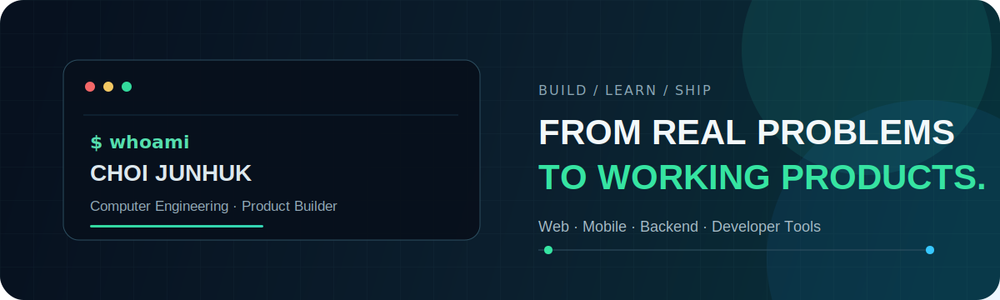
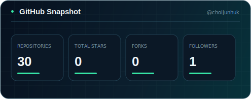
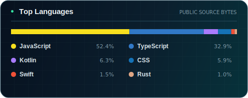
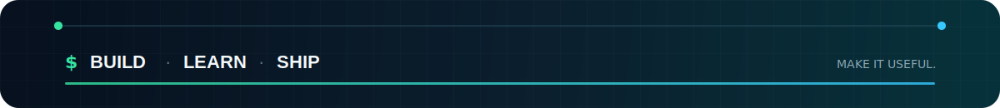

 

# 👋 안녕하세요, 최준혁입니다

### 광운대학교 컴퓨터공학과 26학번

웹, 모바일, 백엔드와 개발 도구를 연결해 
**발견한 문제를 실제로 쓸 수 있는 제품으로 만드는 과정**을 좋아합니다.

 

  

  

---

## 🛠️ Tech Stack

제품을 만들면서 실제로 사용하고 있는 기술입니다.

### Language

### Web · Mobile

### Backend · Data · Infra

  

---

## 🚀 Selected Products

아이디어에서 멈추지 않고 직접 구현하고 운영한 프로젝트입니다.

  

<table width="100%">
  <tr>
    <td align="center" width="50%" valign="top">
      
        
      <b>알고리즘 학습을 하나의 플레이 경험으로</b>
       
      문제 풀이 · 대전 · 아케이드를 연결한 학습 플랫폼
        
      <code>React</code> <code>Node.js</code> <code>MySQL</code> <code>Docker</code>
    </td>
    <td align="center" width="50%" valign="top">
      
        
      <b>광운대 구성원을 안전하게 연결</b>
       
      학교 이메일 인증을 기반으로 한 매칭 서비스
        
      <code>Next.js</code> <code>TypeScript</code> <code>Prisma</code> <code>PostgreSQL</code>
    </td>
  </tr>
  <tr>
    <td align="center" width="50%" valign="top">
       
      
        
      <b>알람보다 실제 기상 성공에 집중</b>
       
      Android · iOS · Wear OS를 잇는 알람 앱
        
      <code>Kotlin</code> <code>Jetpack Compose</code> <code>Rust</code>
    </td>
    <td align="center" width="50%" valign="top">
       
      
        
      <b>동아리의 활동과 운영을 한곳에서</b>
       
      공지 · 회원 · 행사 흐름을 연결한 공식 서비스
        
      <code>React</code> <code>Spring Boot</code> <code>MySQL</code>
    </td>
  </tr>
</table>

 

<b>📦 다른 프로젝트 9개 더 보기</b>

 
<table width="100%">
  <tr>
    <td width="33%"><a href="https://github.com/choijunhuk/coms-member-app"><b>COMS Member App</b></a> 회원용 모바일 앱</td>
    <td width="33%"><a href="https://github.com/choijunhuk/team-role-randomizer"><b>팀메이트 랜덤 배정</b></a> 공정한 팀·역할 구성</td>
    <td width="33%"><a href="https://github.com/choijunhuk/LogDoctor"><b>LogDoctor</b></a> 서버 로그 원인 분석</td>
  </tr>
  <tr>
    <td><a href="https://github.com/choijunhuk/BugSnap"><b>BugSnap</b></a> 스크린샷 OCR 버그 리포트</td>
    <td><a href="https://github.com/choijunhuk/PRDoctor"><b>PRDoctor</b></a> PR 리뷰·보안 분석</td>
    <td><a href="https://github.com/choijunhuk/gameclub"><b>GameClub</b></a> COMS 게임 파티 모집</td>
  </tr>
  <tr>
    <td><a href="https://github.com/choijunhuk/saturday-food-club"><b>토요일 뭐 먹지?</b></a> 소모임 맛집 기록</td>
    <td><a href="https://github.com/choijunhuk/kwtop"><b>kwtop</b></a> Rust 시스템 모니터</td>
    <td><a href="https://github.com/choijunhuk/Project-ASCENT"><b>Project ASCENT</b></a> 덱빌딩 로그라이크</td>
  </tr>
</table>

  

---

## 📊 GitHub Activity

공개 저장소 데이터를 매일 정적 SVG로 갱신합니다.

  

  

---

## 📚 Currently Interested In

  

## 🧭 How I Build

  

---

## 🧑‍💻 Contact

함께 만들 이야기나 피드백이 있다면 편하게 연락해 주세요.

 

  

